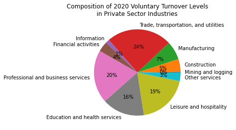
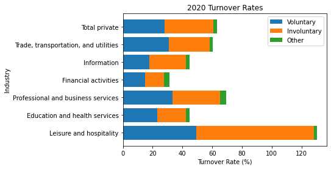
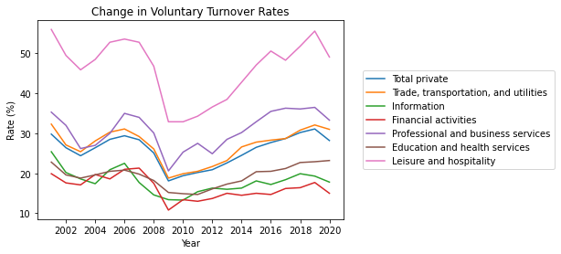
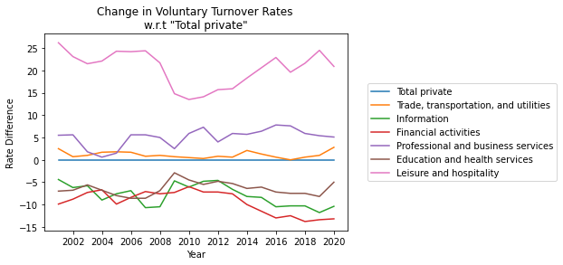
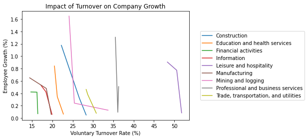

# Capstone Project Propsal

**Summary**

**Scope**

**Audience**

* Who is the project useful for? 
* How will it help them? 
* Why should others find it interesting?

**Key Takeaways**

* The solution:
* Technical accomplishments:
* Other interesting aspects:

## Motivation

## Data sources

1. "Job Openings and Labor Turnover Survey (JOLTS)" from the US Bureau of Labor Statistics (BLS)
	* Summary: National estimates of turnover rates from 2000-2020
	* [Description](https://download.bls.gov/pub/time.series/jt/jt.txt) provided by BLS with dataset
	* [Download](https://download.bls.gov/pub/time.series/jt/) [13MB]
	* Relevant information: Turnover rates broken down by type (voluntary, involuntary, and other), NAICS industry name, and year

1. "Linkedin Profiles" from Thinknum Media
	* Summary: Records of follower and employee counts on LinkedIn for various companies between 2015-2018
	* [Description](https://blog.thedataincubator.com/2018/08/2018-data-sources-data-science-projects/) from "2018 Data Sources for Cool Data Science Projects, provided by Thinknum" posted by Sean Boland on August 6, 2018
	* [Download](https://us8.mailchimp.com/mctx/clicks?url=https%3A%2F%2Fs3-us-west-2.amazonaws.com%2Fdocuments.thinknum.com%2Fdataset_dump%2Fflikerqvnk%2Ftemp_datalab_records_linkedin_company.zip&h=bb33dfa0f37f4299a52e66186a0bfb51e62cac5de0fadf951d70b5fa79bb5d03&v=1&xid=6a357ce64d&uid=29791003&pool=contact_facing&subject=Here%27s+your+data+sets+from+The+Data+Incubator+and+Thinknum) [287MB zip &#8594; 910MB csv]
	* Relevant information: Company ID, company name, industry, entry date, follower count, and number of listed employees

## Analysis

**Current Achievments**

**Future Goals**

## Other Details

**Job Search Preferences**
