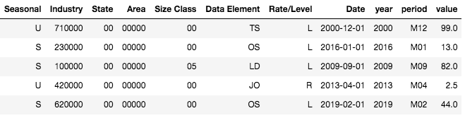
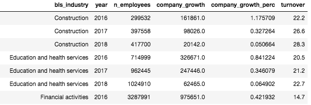

# Capstone Project Propsal

**Scope**

This project aims to create a website providing:

 1. a custom analytics reports on company turnover rates
 1. models estimating the impact of various turnover mitigation strategies 
 1. suggestions for new data to track relating to turnover

**Audience**

* The end user for this project is HR departments, most likely in small to mid-size companies.

* The project aims to help with 3 needs: 
	1. appropriately contextualizing turnover rates seen in their company
	2. estimating the impacts of various strategies on turnover rates
	3. identifying valuable data to track moving forward.

* A [2018 survey](https://www.shrm.org/hr-today/trends-and-forecasting/research-and-surveys/pages/employee-recognition-2018.aspx) by the Society for Human Resource Management showed 47% of HR professionals listed turnover as their top challenge. 

## Motivation

A fraction of employees leaving a company in a given period (i.e. turnover) is an unavoidable part of any business. In fact, much of it is needed to improve talent and remain competitive. However, the negative consequences of lost productivtity and a bad company image can quickly get out of hand. Knowing how to track and measure turnover while distinguishing turnover intiatied by the company (i.e. involuntary turnover) versus by the employee (i.e. voluntary turnover) is crucial for being proactive in striking healthy turnover rates.

While various IT solutions companies likely provide analytics on turnover, the prevalence of online resources for manually calculating turnover rates suggests many companies do not do this regularly or choose not to pay for outside help. The value of this project will be from providing a free initial report based on public data to help companies decide whether to invest in more costly consulting packages.

## Data sources

1. "Job Openings and Labor Turnover Survey (JOLTS)" from the US Bureau of Labor Statistics (BLS)
	* Summary: National estimates of turnover rates from 2000-2020
	* [Description](https://download.bls.gov/pub/time.series/jt/jt.txt) provided by BLS with dataset
	* [Download](https://download.bls.gov/pub/time.series/jt/) [13MB]
	* Relevant information: Turnover rates broken down by type (voluntary, involuntary, and other), [NAICS](https://www.census.gov/naics/) industry name, and year

1. "Linkedin Profiles" from Thinknum Media
	* Summary: Records of follower and employee counts on LinkedIn for various companies between 2015-2018
	* [Description](https://blog.thedataincubator.com/2018/08/2018-data-sources-data-science-projects/) from "2018 Data Sources for Cool Data Science Projects, provided by Thinknum" posted by Sean Boland on August 6, 2018
	* [Download](https://us8.mailchimp.com/mctx/clicks?url=https%3A%2F%2Fs3-us-west-2.amazonaws.com%2Fdocuments.thinknum.com%2Fdataset_dump%2Fflikerqvnk%2Ftemp_datalab_records_linkedin_company.zip&h=bb33dfa0f37f4299a52e66186a0bfb51e62cac5de0fadf951d70b5fa79bb5d03&v=1&xid=6a357ce64d&uid=29791003&pool=contact_facing&subject=Here%27s+your+data+sets+from+The+Data+Incubator+and+Thinknum) [287MB zip &#8594; 910MB csv]
	* Relevant information: Company ID, company name, industry, entry date, follower count, and number of listed employees

## Analysis
### Current Achievments
**JOLTS Survey Data Preprocessing**

Most of the entry information is encoded in a 21 character string (e.g. `JTS000000000000000JOR`). Therefore, preprocessing required string parsing and decoding according to several map files accompanying the survey data. Minimal cleaning is needed. The end result

**JOLTS Survey Data EDA**

The pie chart below shows the relative contributions of each private sector industry towards total voluntary turnover in the last year. 
We expect that overall turnover rates for the private sector will be mostly influenced by turnover in "Trade, transportation, and utilities" as well as "Professional and business services" and "Leisure and hospitality".

The stacked bar chart below dives deeper into a specific industries (and combined private sector) to see how much of an industries overall turnover comes from voluntary turnover, involuntary turnover, and other turnover (e.g. retirement, change departments).
We see that in most cases voluntary and involuntary turnover rates are similar with the exception of leisure and hospitality where involuntary is much greater. This is likely an anomaly caused by the COVID-19 Pandemic's unique impact on that industry.

Given the unique nature of 2020, 	the line plot below highlights the dynamics of voluntary rates since 2000 for the same industries as the previous figure. As expected there is a large dip around the 2008 financial crisis and a dip starting in 2020 as people attempt to hold onto jobs if they can. However, the variations are still much larger between industries than across time.

To smooth out the variations over time impacting all industries, the line plot below modifies the one above by subtracting the voluntary turnover rate of the private sector as a whole. Now the difference between industries is clearer and we can see the increase of voluntary turnover in the leisure and hospitality industry is counteracted by a relative decrease in the finance and information industries.

To go beyond understanding general trends in US industries and where one's company might fit in, it is worth seeing how turnover rates correlate with other features of an industry. More importantly, can causal inferences be made to suggest how a manager might influence their company's turnover rates.

**LinkedIn Company Profile Data Preprocessing**

The LinkedIn Company Profile dataset provides a lot of data on individual companies that can be compared with the JOLTS survey to derive business value. However, this dataset is significantly larger and requires more cleaning.

* It takes a minute to load the LinkedIn csv file into a pandas DataFrame. Many of the columns are ignored, reducing memory needs and making it unecessary to consider loading in chunks. Nevertheless, the inital EDA is done on subsets of the data. Also, summary data files are produced to faciliate studying the types of companies and industries included. 
* To make possible comparisons with the JOLTS Survey data, a map was manually created between the 100+ self-reported industries of the LinkedIn dataset with the 10 NAICS industires of the JOLTS Survey.
* Data cleaning focused on the industry column which for some entries was empty, contained typos, or even was incorrect relative to NAICS.

Using the last entry per year for each company in the LinkedIn data, a table join is carried out with the JOLTS survey on the industry and year. The percentage change in the total employee count for each industry and each year is then compared with the corresponding voluntary turnover rates resulting in the table below

**LinkedIn Company Profile Data EDA**

The line plot below looks at the annual industry growth rate compared to the turnover seen that year. The downward sloping lines for most industries suggest a quick dropoff in company growth as voluntary turnover increases.  

The observed correlation is preliminary until more validation is done on the LinkedIn data. However, the figure illustrates well how one might demonstrate the value of measuring and thinking about turnover rates. 

## Future Goals

1. Create the user interface for HR employees to enter their companies raw employment data, allowing the above plots to be overlaid with data from a specific company for comparison.
1. Gather data on turnover mitigation strategies to allow for building models (e.g. GLM, kNN) that might estimate the impacts of those strategies for a different company.
